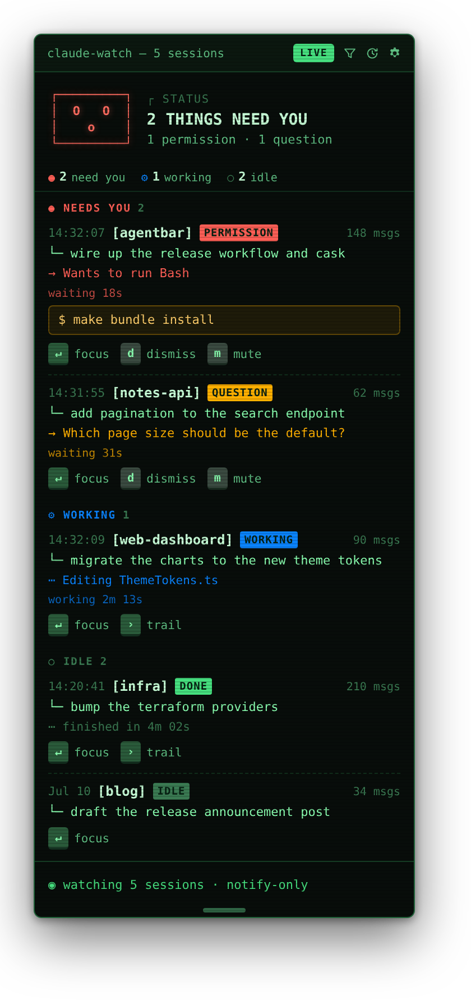
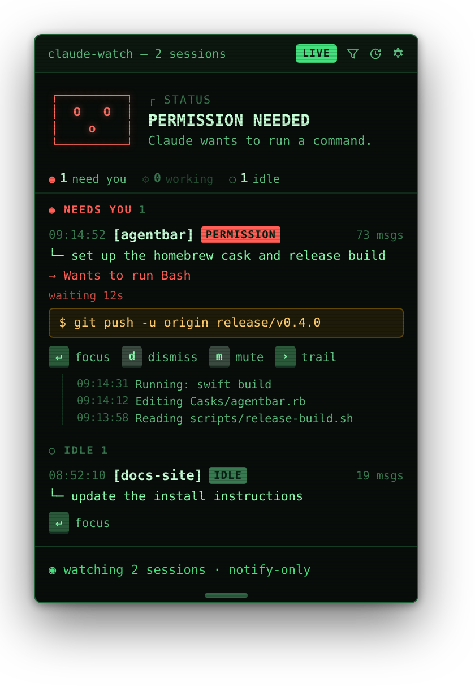
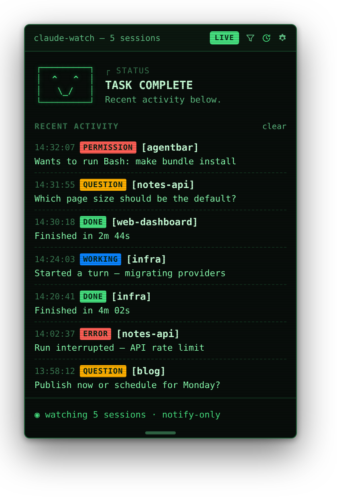

# AgentBar

A native macOS menu bar app that watches your terminal coding agents — **Claude Code** and
**GitHub Copilot CLI** — through a zero-config plugin (Claude) and a one-command hook install
(Copilot). When an agent needs something from you — a multiple-choice question, a permission
prompt, or it has gone idle waiting for input — AgentBar notifies you and brings your terminal
back to the front so you can answer there. It is a **notification tool, not an input tool**: it
never blocks your session and never sits between you and the agent.

<p align="center">
  
</p>

<p align="center"><sub><i>The AgentBar popover — a live, read-only overview of every Claude Code session, with what needs you floated to the top. (UI preview rendered from the app's design, not a photo of a running app.)</i></sub></p>

## How it works

```
Claude Code session → plugin hook → AgentBar local server → menu bar / banner
        │                              (returns immediately)
        └── session continues; you answer the prompt in your terminal
```

1. The plugin registers hooks across Claude Code's interaction points: turn starts
   (`UserPromptSubmit`, surfaced as a live "thinking" status), questions
   (`AskUserQuestion`), permission requests, MCP input requests (`Elicitation`), tool
   completions (`PostToolUse`, used to auto-clear a prompt once you answer it in the
   terminal), idle notifications, and the task-finished / subagent-finished / session-ended
   / run-interrupted (`Stop`, `SubagentStop`, `SessionEnd`, `StopFailure`) events.
2. When one fires, the bundled `bin/agentbar-hook` script reads the payload and POSTs it
   to AgentBar's local HTTP server (`127.0.0.1`, ephemeral port, per-launch bearer token
   published to `~/Library/Application Support/AgentBar/server.json`). It launches the
   app first if it is not already running.
3. The server acknowledges immediately (fire-and-forget), so the hook returns at once and
   your session is never blocked. AgentBar queues the item, badges the menu bar icon, and
   posts a notification showing what Claude is asking.
4. You answer the prompt in your terminal as usual. Clicking the banner (or the "Focus"
   button in the popover) brings the session's own terminal/IDE window back to the front.
   Once you answer, AgentBar notices the session make progress (`PostToolUse` / `Stop`) and
   clears the item automatically.

**Fail-open contract:** the CLI always returns immediately. If the app is missing,
unreachable, or errors in any way, the hook exits cleanly with no output — exactly as if
AgentBar were never installed. Because AgentBar never returns a decision to Claude Code,
every prompt is always answered in the terminal.

## Install

AgentBar has two halves — the **app** (menu bar UI) and the **plugin** (the hooks that
feed it). Install both.

### 1. App (Homebrew cask)

```sh
brew tap jreed91/claude-notification https://github.com/jreed91/claude-notification
brew install --cask agentbar
```

Then launch AgentBar once so macOS can grant it notification permission. The explicit tap
URL is required because the repository is not named `homebrew-*`.

### 2. Plugin (Claude Code marketplace)

In Claude Code:

```
/plugin marketplace add jreed91/claude-notification
/plugin install agentbar@agentbar
```

The plugin's hooks activate automatically on install — no `settings.json` editing needed.

### 3. GitHub Copilot CLI (optional)

AgentBar also watches [GitHub Copilot CLI](https://docs.github.com/en/copilot/how-tos/copilot-cli)
sessions. Copilot loads personal hooks from JSON files in its config directory rather than from
a marketplace, so wiring it up is a one-time command instead of a plugin install. With the app
installed (step 1), run:

```sh
brew install --cask agentbar          # if you haven't already (step 1)
git clone https://github.com/jreed91/claude-notification && cd claude-notification
make install-copilot                   # writes ~/.copilot/hooks/agentbar.json
```

`make install-copilot` (a thin wrapper over `scripts/install-copilot-hooks.sh`) stamps the
absolute path of the hook bridge bundled inside `AgentBar.app` into
`~/.copilot/hooks/agentbar.json`. Restart any running Copilot sessions and they will start
feeding AgentBar. Remove the wiring with `make uninstall-copilot`.

Copilot's hook surface exposes lifecycle and status events — turn started, tool completed,
task finished, subagent finished, session ended, and errors — but it has no equivalent of
Claude Code's `AskUserQuestion` / permission / MCP-input prompts, so **questions and permission
requests remain Claude-only**. Copilot sessions still appear in the roster and dashboard (read
from `~/.copilot/session-state`), tagged `COPILOT`, and their working/finished/error states
surface exactly like Claude's.

## What AgentBar shows you

Every event is a notification — AgentBar never intercepts or answers a prompt for you.

<p align="center">
  
</p>

<p align="center"><sub><i>A permission request surfaced for context — the tool, its command, and how long it's been waiting. The keycaps <b>focus</b> your terminal or <b>dismiss</b> the row; you still allow or deny in the terminal.</i></sub></p>

| Event | What you see | What you do |
|---|---|---|
| **Thinking** (`UserPromptSubmit`) | A live "working" status while Claude is on a turn (no banner) | Nothing — it clears itself when the turn ends |
| **Question** (`AskUserQuestion`) | The question and its options, for context | Answer in the terminal; click to focus it |
| **Permission request** | The tool and its input, so you know what Claude wants | Allow/deny in the terminal; click to focus it |
| **MCP input request** (`Elicitation`) | The server's message and the fields it wants | Fill it in the terminal; click to focus it |
| **Idle / waiting** | Claude is waiting for input | Click to focus the terminal |
| **Task finished** (`Stop`) | The turn completed | Click to focus the terminal |
| **Subagent finished** (`SubagentStop`) | A spawned subagent completed | — |
| **Session ended** (`SessionEnd`) | The session closed | — |
| **Run interrupted** (`StopFailure`) | Surfaces API errors such as rate limits, overload, or billing problems | — |

Questions, permissions, and MCP input requests badge the icon and stay in the popover
until they're resolved. There is no reply channel back into the session, so AgentBar can't
clear them the instant you answer — instead it watches for the session to make progress and
clears them then, which in practice is a beat after you respond in the terminal. That
progress can be the next tool run, the turn finishing, the *next* prompt appearing, or a new
turn starting — a session can only get that far once you've answered whatever it was blocked
on, so an answered permission clears itself rather than lingering behind its successor. You
can also dismiss any item by hand. Informational rows auto-expire. Every event has a toggle
in Settings, so chatty ones (subagent and session-end in particular) can be muted
individually.

### Banner actions, mute & Do Not Disturb

Banners carry inline buttons — but AgentBar stays notify-only, so none of them answer a
prompt for you:

- **Dismiss** clears the row (and its banner).
- **Snooze 10 min** hushes an attention item and re-posts it later if it is still waiting.
- **Copy command** (on permission banners that carry a shell command) puts the command on
  the clipboard so you can paste it in the terminal.

For sessions that are noisy, click **mute** on the session's row in the popover — its events
still show in the feed and still badge the icon, but post no banner and play no sound. A
**Do Not Disturb** window in Settings does the same globally for a time range (e.g. 10 PM →
8 AM). Settings also has **distinct sounds per event type** (so a permission sounds
different from a finished task), a configurable **auto-dismiss** interval for informational
rows, and a **debug logging** toggle that records raw hook payloads to
`~/Library/Application Support/AgentBar/debug.log` for troubleshooting.

### Attention timing & history

Attention rows show a live **waiting …** timer so you can see how long a prompt has been
sitting, and a finished turn reports **how long it took** ("finished in 2m 13s"). The clock
icon in the title bar flips the feed to a **recent-activity log** — a newest-first record of
what was surfaced while you were away, without digging through transcripts. Clicking the hero
status jumps you straight to the terminal of whatever most recently needs you.

<p align="center">
  
</p>

<p align="center"><sub><i>The recent-activity log — everything AgentBar surfaced while you were away, newest first.</i></sub></p>

## The session list

The popover lists your Claude Code sessions, **most recent first, one row per project**.
The roster is read straight from Claude Code's on-disk transcripts
(`~/.claude/projects/**/*.jsonl`, or under `$CLAUDE_CONFIG_DIR`), so sessions show up even
if they started before AgentBar was running or live in a terminal that never sent a hook. A
project you have run many times collapses to a single row for its latest session. Each row
shows the project, its first prompt as a title, a message count, and when it was last
active; quiet sessions are tagged `IDLE`. For Claude Code sessions each row also carries a
meta line — the **model** the latest turn ran on, the session's **permission mode**
(`default` / `plan` / `accept edits` / `bypass`), and its **context usage** (`ctx 48k · 24%`,
tinting amber then red as the window fills) — all read from Claude Code's own transcript and
hook events. The usage percentage is sized to the model's context window — 200k for most,
1M for models that ship a 1M window (e.g. Opus 4.8), and 1M for any session whose usage has
crossed the 200k tier (a 200k model can't exceed its window, so it must be a larger one, such
as a Sonnet 4+ session on the 1M beta the transcript doesn't record).

Live hook events fold into the matching row by session id: a session waiting on a question
or permission tags itself `QUESTION` / `PERMISSION` and shows the prompt (and any command)
inline with the same focus/dismiss keycaps. When you answer in the terminal, the row settles
back to its resting state. The scan runs only while the popover is open — on open and on a
light interval — and parses just the most recent sessions, caching by file modification date
so repeat scans are nearly free.

**Focus** brings the session's window forward. If you grant AgentBar **Accessibility**
permission (System Settings → Privacy & Security → Accessibility), it raises the *specific*
window whose title matches the project, so the right window comes forward even with many
open — it matches on the session's working directory, which works for scanned rows that
never sent a hook. Without the permission it falls back to activating the terminal app, so
focus keeps working (just less precisely).

The popover is taller-adjustable — drag the handle on its bottom edge to grow it downward —
and the height is remembered across launches.

### Keyboard

The list is fully keyboard-drivable while the popover is open. **↑/↓** (or **j/k**) walk the
rows in reading order — needs-you first — highlighting the selected one and scrolling it into
view. The selected row's actions are one keystroke away, mirroring its keycaps: **↵** focuses
its terminal, **d** dismisses a live prompt, **m** mutes/unmutes the project, and **→** (or
**t**) expands its activity trail. **Esc** clears the selection. A click on a row selects it
too, so mouse and keyboard stay in sync.

### Multi-agent dashboard

For running several Claude Code sessions at once, the session list doubles as a read-only
dashboard — a legible overview of your parallel agents. It stays true to the notify-only
contract: everything here is *awareness*, derived from the same hooks and transcripts
AgentBar already reads. There is no reply channel, no control, nothing that answers a prompt
or steers an agent.

- **Summary strip.** A pinned header counts your sessions by state: `● need you`,
  `⚙ working`, `○ idle`.
- **Grouped roster.** Rows are grouped under `NEEDS YOU` / `WORKING` / `IDLE` headers, so
  what needs you floats to the top.
- **Current activity.** Each session that isn't waiting on you shows what it's doing — the
  last tool it ran (`Editing QueueStore.swift`, `Running: swift build`, `Searching …`) or a
  snippet of its last message, read from the transcript.
- **Working timer.** Actively-working sessions show how long the current turn has been
  running (`working 2m 13s`), alongside the existing `waiting …` timer on prompts.
- **Activity trail.** A `trail` keycap on each row expands a read-only history of its recent
  actions, newest-first with timestamps — the closest thing to watching an agent work,
  without attaching to it.
- **Live-only filter.** The filter button in the title bar hides quiet historical sessions,
  leaving just the ones a terminal is plausibly still open on.

See [`docs/paseo-feature-analysis.md`](docs/paseo-feature-analysis.md) for how this compares
to Paseo and why AgentBar stays read-only.

## Development

Building requires **macOS 14+ with the Xcode command line tools** (`xcode-select
--install`).

A local ad-hoc (unsigned) build installed to `/Applications`:

```sh
make bundle install
```

Other useful targets: `make build`, `make bundle`, `make adhoc`, `make clean`. See the
`Makefile` for signing, zipping, and notarizing targets.

Run the unit tests (the hook-payload parsers and duration formatting) with `make test` (or
`swift test --package-path app`); they run in CI on every pull request. To diagnose a broken
install end to end, `make doctor` checks that both halves are wired up, and
`plugin/bin/agentbar-hook --selftest` probes the CLI → server pipeline and prints what it
finds.

Repository layout:

```
claude-notification/
├── .claude-plugin/marketplace.json    # plugin marketplace (repo root)
├── docs/implementation-plan.md        # full design & decisions
├── plugin/                            # the Claude Code plugin ("agentbar")
│   ├── .claude-plugin/plugin.json
│   ├── hooks/hooks.json               # PreToolUse / PermissionRequest / Elicitation / Notification / Stop / SubagentStop / SessionEnd / StopFailure
│   └── bin/agentbar-hook              # dependency-free bash bridge (curl + sed); agent-agnostic
├── copilot/                           # GitHub Copilot CLI integration
│   └── hooks/agentbar.json            # hook config template → ~/.copilot/hooks/agentbar.json
├── app/                               # Swift package for AgentBar.app
│   ├── Package.swift
│   ├── Sources/AgentBar/
│   └── Support/Info.plist
├── Casks/agentbar.rb                  # Homebrew cask → GitHub Releases
├── scripts/
│   ├── bundle.sh                      # assemble dist/AgentBar.app (bundles agentbar-hook into Resources)
│   ├── install-copilot-hooks.sh       # write ~/.copilot/hooks/agentbar.json (make install-copilot)
│   └── update-cask.sh                 # stamp version + sha256 into the cask
├── .github/workflows/                 # ci.yml, release.yml
├── Makefile
└── README.md
```

## Commits & releasing

Releases are **fully automated** from the commit history — there is no manual tag step.

### Conventional Commits

Commit messages follow [Conventional Commits](https://www.conventionalcommits.org/).
The type prefix drives the next version and the generated release notes:

| Prefix | Example | Release effect |
|---|---|---|
| `fix:` | `fix: stop popover header from clipping` | patch (`0.3.0` → `0.3.1`) |
| `feat:` | `feat: add per-session mute toggle` | minor (`0.3.0` → `0.4.0`) |
| `feat!:` / `BREAKING CHANGE:` footer | `feat!: drop macOS 13 support` | major (`0.3.0` → `1.0.0`) |
| `docs:`, `chore:`, `refactor:`, `test:`, `ci:`, `style:`, `perf:` | `chore: bump deps` | no release |

The **Lint commit messages** CI job (commitlint) enforces this on every pull request, so
non-conforming commits are caught before they reach `main`. Config lives in
`commitlint.config.js`.

### Automated releases

On every push to `main`, `release.yml` runs [semantic-release](https://semantic-release.gitbook.io/):

1. It analyzes the commits since the last `v*` tag and decides the next version (or exits
   if nothing warrants a release).
2. `scripts/release-build.sh` builds, signs, notarizes, and zips `AgentBar.app` for that
   version and stamps `Casks/agentbar.rb`.
3. semantic-release tags `vX.Y.Z`, publishes a GitHub Release with generated notes and the
   zip asset, and commits the updated cask back to `main` (`chore(release): … [skip ci]`).

No `settings.json` or tag pushing needed — merge a `fix:`/`feat:` PR and the release ships
itself.

Required repository secrets:

| Secret | Purpose |
|---|---|
| `MACOS_CERT_P12` | Base64-encoded Developer ID Application certificate (`.p12`) |
| `MACOS_CERT_PASSWORD` | Password for the `.p12` |
| `MACOS_SIGNING_IDENTITY` | Codesign identity, e.g. `Developer ID Application: Name (TEAMID)` |
| `APPLE_ID` | Apple ID for notarization |
| `APPLE_TEAM_ID` | Apple Developer Team ID |
| `APPLE_APP_PASSWORD` | App-specific password for notarization |

## Design

See [docs/implementation-plan.md](docs/implementation-plan.md) for the full design,
hook mechanics, server protocol, and known limitations.